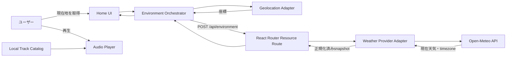
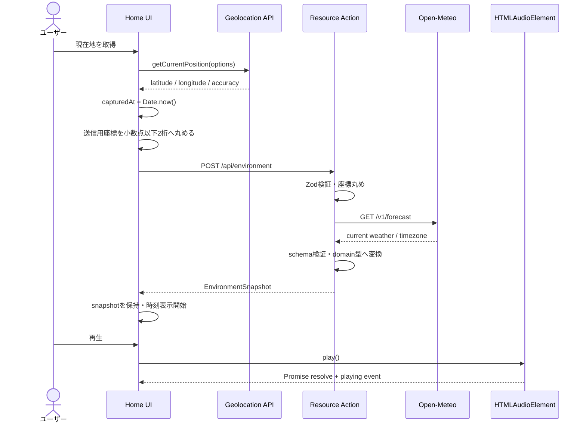

# MOSA MVP 機能・技術設計

## 1. この文書の目的

MVPで実装する以下の4機能について、機能要件、採用技術、責務、データ契約、処理フロー、テスト方針を定義する。

認証は本書作成後に追加されたスコープである。認証に関する現在の仕様は
[`auth-integration.md`](auth-integration.md) を優先する。

- 楽曲を再生する
- 現在時刻を取得する
- 現在地を取得する
- 現在地に対応する天気情報を取得する

優先度2・3の機能はMVPに含めない。ただし、外部サービスや選曲ロジックを後から差し替えられる境界を設け、MVPの実装を全面的に作り直さず拡張できる構成にする。

## 2. 結論

MVPでは次の構成を採用する。

| 領域 | 採用技術 | 採用理由 |
| --- | --- | --- |
| UI・画面 | React 19、React Router 8 Framework Mode | 現在のプロジェクト構成をそのまま利用でき、resource routeと`useFetcher`でフロント・サーバー間通信も扱える |
| 現在地 | Browser Geolocation API | ブラウザから端末の位置情報を取得する標準手段であり、外部ライブラリが不要 |
| 現在時刻 | `Date.now()`、`Intl.DateTimeFormat` | 時刻専用APIを増やさず、IANAタイムゾーンを指定した表示ができる |
| 天気 | Open-Meteo Forecast API | 非商用MVPではAPIキーなしで利用でき、座標から現在の天気とタイムゾーンを一度に取得できる |
| 外部API接続 | React Router resource route | 座標の検証、レスポンスの正規化、API差し替え、タイムアウト処理をサーバー側に集約できる |
| 楽曲再生 | `<audio>` / `HTMLAudioElement` | 標準APIだけで再生、一時停止、音量、再生位置、エラーを扱える |
| 楽曲ソース | 権利処理済みのMP3/AAC音源 | 認証をMVPに持ち込まず、再生機能そのものを検証できる |
| 入力検証 | Zod 4 | ブラウザ入力と外部APIレスポンスを実行時に検証し、TypeScript型も同じ定義から推論できる |
| 状態管理 | Reactのローカル状態 + `useFetcher` | MVPの状態量ではReduxやZustandは不要。ネットワーク状態はReact Routerに任せる |
| テスト | Vitest | 既に導入済みで、ドメイン変換、入力検証、エラー処理を高速にテストできる |

Geolocation APIはHTTPSのセキュアコンテキストとユーザー許可を必要とする。開発中の`localhost`を除き、デプロイ先はHTTPSを必須とする。[^1] また、音声の自動再生はブラウザに拒否される可能性があるため、データ取得完了後にユーザーが再生ボタンを押す仕様とする。`play()`の成否は返却されるPromiseで判断する。[^2]

## 3. 設計の前提

本設計では以下を前提とする。前提が変わる場合は「14. 未決事項と判断ポイント」を再確認する。

- MVPはハッカソン・検証用途の非商用サービスである。
- 認証は追加スコープとしてFirebase AuthenticationとGo APIで提供する。
- MVPでは楽曲検索、レコメンド、プレイリスト作成を行わない。
- 再生対象はプロジェクトが配信権を保有する、または利用条件を満たす音源である。
- 対象ブラウザは、直近のChrome、Edge、Safari、Firefoxとする。
- フロントエンドとReact Routerサーバーは同一オリジンで配信する。
- 利用にはネットワーク接続が必要である。ただし、時刻表示と取得済み音源の再生状態は天気API障害と分離する。
- 現在地の住所・施設名表示はMVP対象外とし、緯度・経度と精度を「現在地」として扱う。

## 4. MVPのスコープ

### 4.1 機能要件

#### FR-01 現在地取得

- ユーザーが「現在地を取得」操作を行ったときだけ位置情報の許可を要求する。
- `navigator.geolocation.getCurrentPosition()`で緯度、経度、精度、取得時刻を取得する。
- 天気用途では高精度GPSを必須にしない。
- 許可拒否、位置取得不能、タイムアウトを区別して表示する。
- エラー後に再試行できる。
- 正確な座標はブラウザのメモリ内だけに保持し、Local Storage、Cookie、URLには保存しない。

推奨オプション:

```ts
const geolocationOptions: PositionOptions = {
  enableHighAccuracy: false,
  timeout: 10_000,
  maximumAge: 5 * 60_000,
};
```

天気モデルはGPSの数メートル精度を必要としないため、`enableHighAccuracy: false`を採用する。取得速度と端末消費電力を優先し、5分以内のキャッシュ位置を許容する。

#### FR-02 現在時刻取得

- `Date.now()`で現在の瞬間を取得する。
- 天気APIが返すIANAタイムゾーンを使い、`Intl.DateTimeFormat("ja-JP", { timeZone })`で現地時刻を表示する。`Intl.DateTimeFormat`は指定したタイムゾーンに同一の時点を変換して表示できる。[^3]
- 画面表示は30秒ごとに更新する。
- 選曲などの判定には表示文字列ではなく、Unix epoch millisecondsとIANAタイムゾーンを渡す。
- 端末時計は改変され得るため、課金、監査、有効期限のような信頼時刻には使わない。MVPの時間帯判定と画面表示には十分とする。

時刻取得は位置取得に技術的には依存しない。位置取得後にタイムゾーンが確定するため、「現在地の現地時刻」の表示は天気レスポンス受信後に確定する。

#### FR-03 天気取得

- 現在地取得後、緯度・経度をReact Routerサーバーへ送る。
- サーバーは入力を検証し、Open-Meteo Forecast APIから現在の天気を取得する。
- 取得対象は気温、体感温度、降水量、天気コード、昼夜区分、観測・モデル時刻、タイムゾーンとする。
- Open-Meteo固有のレスポンスを画面へ直接渡さず、アプリ内の`WeatherSnapshot`へ変換する。
- 成功した情報は10分間を有効期限とし、期限後は再取得できる。
- APIエラー時も時刻表示と音楽プレイヤーは操作できる。
- 画面上にOpen-Meteoへの帰属表示を行う。

Open-Meteoは座標、`current`変数、`timezone=auto`を受け取り、現在の気象値と座標に対応するタイムゾーンを返せる。[^4] 無料APIは非商用、1日10,000リクエストまでで、稼働保証はない。データはCC BY 4.0のため帰属表示が必要である。[^5]

#### FR-04 楽曲再生

- 権利処理済みの音源を1曲以上登録できる。
- ユーザー操作により再生、一時停止、先頭から再生ができる。
- 音量を0から1の範囲で変更できる。
- 楽曲名、アーティスト名、再生状態、現在位置、長さを表示する。
- 読み込み中、再生中、一時停止、終了、エラーを区別する。
- `audio.play()`のPromiseがrejectされた場合は再生中表示にせず、操作可能なエラーを表示する。
- 天気情報取得に失敗していても、デフォルト曲を再生できる。
- MVPではページ表示直後や天気取得完了直後の自動再生を行わない。

`<audio>`は複数の音声ソースを指定でき、ブラウザが対応形式を選択できる。[^6] MVPでは配布しやすいMP3またはAACを第一候補とし、対象端末で再生確認を行う。

### 4.2 非機能要件

| ID | 項目 | MVP基準 |
| --- | --- | --- |
| NFR-01 | セキュリティ | 本番環境はHTTPS。外部入力をZodで検証。サーバー専用処理を`.server`モジュールへ隔離 |
| NFR-02 | プライバシー | 位置取得前に目的を表示。正確な座標を永続化・URL化・ログ出力しない |
| NFR-03 | 応答性 | 位置取得は10秒でタイムアウト。天気APIは5秒でタイムアウト |
| NFR-04 | 可用性 | 天気API障害をプレイヤー障害へ波及させない。再試行を提供 |
| NFR-05 | アクセシビリティ | 全操作をbutton/inputで提供。状態をテキストでも通知。キーボード操作可能 |
| NFR-06 | 保守性 | 外部APIレスポンスをドメイン型へ変換し、画面からプロバイダー固有型を排除 |
| NFR-07 | 観測性 | 座標を含めず、処理結果、エラー分類、外部API所要時間を記録 |

### 4.3 MVP対象外

- Spotify、Apple Musicなど外部ストリーミングサービスへのログインと再生
- 楽曲検索、プレイリスト、Good / Bad、レコメンド
- 住所、都道府県、市区町村、施設名への逆ジオコーディング
- バックグラウンド位置追跡と連続的な`watchPosition()`
- 位置履歴、再生履歴の永続化
- 複数端末間の再生状態同期
- オフライン再生
- 自動再生

## 5. API選定

### 5.1 現在地: Browser Geolocation API

採用する。追加SDKは使用しない。

理由:

- 端末センサーやOSの位置サービスへのブラウザ標準インターフェースである。
- 緯度、経度、精度、取得時刻がMVP要件を満たす。
- ライブラリ依存と外部アカウントがない。
- 許可拒否、取得不能、タイムアウトの3分類を標準エラーコードで識別できる。[^7]

制約:

- HTTPSとユーザー許可が必須である。
- 精度と取得速度は端末、OS、屋内外、ネットワーク状況に左右される。
- iframe配信時はPermissions Policyの設定が必要になる場合がある。
- ブラウザが返すエラー文はデバッグ用であり、そのままユーザーへ表示しない。エラーコードをアプリの日本語メッセージへ変換する。

### 5.2 現在時刻: Date / Intl

採用する。時刻専用の外部API、`dayjs`、`date-fns`はMVPでは使用しない。

理由:

- 現在時刻取得とタイムゾーン付き表示だけならブラウザ標準APIで完結する。
- 外部APIを1つ減らし、障害点、待ち時間、利用制限を増やさない。
- ドメインには数値のinstantとIANAタイムゾーンを保持するため、将来ライブラリへ移行しても画面以外の契約を変えずに済む。

### 5.3 天気: Open-Meteo Forecast API

非商用MVPに採用する。

リクエスト例:

```text
GET https://api.open-meteo.com/v1/forecast
  ?latitude=35.68
  &longitude=139.77
  &current=temperature_2m,apparent_temperature,precipitation,weather_code,is_day
  &timezone=auto
  &timeformat=unixtime
  &forecast_days=1
```

採用理由:

- 非商用の試作ではAPIキーと事前登録が不要である。
- 緯度・経度から直接取得でき、別の地域検索APIを必要としない。
- 現在天気とIANAタイムゾーンを1リクエストで取得できる。
- 天気プロバイダーをサーバー側adapterに閉じ込めるため、後から商用プランや別プロバイダーへ移行できる。

採用条件:

- 画面またはクレジット画面に「Weather data by Open-Meteo.com」のリンクを表示する。
- 非商用条件を外れる前に商用プランまたは別APIを再選定する。
- 10,000リクエスト/日の上限と稼働保証なしを前提に、10分の更新間隔とキャッシュを設ける。
- 座標がOpen-Meteoのログに最大90日含まれる可能性があることをプライバシー説明に含める。[^8]

### 5.4 楽曲: HTMLAudioElementと権利処理済み音源

MVPでは外部音楽APIを採用しない。`public/audio/`または同等の静的配信先に置いた音源を`HTMLAudioElement`で再生する。

Spotify Web Playback SDKはMVPでは不採用とする。Spotify再生にはOAuthアクセストークンとPremiumアカウントが必要であり、`streaming`などのscopeも要求される。[^9] さらに利用ポリシー上の制約があるため、認証を優先度2としている現在のMVPへ入れると、スコープと受け入れ条件が大きく変わる。

Spotifyカタログの再生がMVPの必須条件になった場合は、次を同時に変更する必要がある。

- 認証を優先度1へ移す。
- Spotify Premiumを動作条件として明記する。
- OAuth Authorization Code with PKCEまたは安全なサーバー側フローを設計する。
- Spotify Developer Policyと商用可否を再確認する。
- ローカル再生adapterとは別に`SpotifyPlaybackAdapter`を追加する。

## 6. ライブラリ選定

### 6.1 使用するライブラリ

| ライブラリ | 区分 | 役割 | 基本的な使い方 |
| --- | --- | --- | --- |
| React | 既存・runtime | UI、ローカル状態、プレイヤーイベント反映 | feature component、custom hook、`useReducer`、`useRef` |
| React Router | 既存・runtime | 画面、resource route、送信中状態、サーバー処理 | `route()`、resource `action`、`useFetcher()` |
| Zod | 新規・runtime | resource route入力とOpen-Meteoレスポンスの実行時検証 | `schema.safeParse(value)`で成功・失敗を分岐 |
| TypeScript | 既存・development | ドメイン型、adapter契約、状態遷移の静的検査 | discriminated unionと`interface`を使用 |
| Vitest | 既存・development | 純粋関数、schema、adapter、reducerのテスト | 外部I/Oを注入しfakeへ差し替える |

ZodはTypeScript-firstのschema validationで、実行時検証と静的型推論を同じschemaから得られる。外部入力をTypeScriptの型注釈だけで信用しないために使用する。[^10]

導入コマンド:

```bash
cd react-router
npm install zod
```

### 6.2 MVPで追加しないライブラリ

| 候補 | 追加しない理由 | 再検討条件 |
| --- | --- | --- |
| Axios | Node 24とブラウザの標準`fetch`で足りる | 共通interceptorなどが大規模化した場合 |
| Redux / Zustand | MVPの共有状態が小さく、サーバー通信状態は`useFetcher`が持つ | 複数画面で複雑な編集途中状態を共有する場合 |
| TanStack Query | React Routerがfetcher状態と再検証を提供する | React Router外のAPIキャッシュ要件が増えた場合 |
| dayjs / date-fns | 現在時刻表示と時間帯分類は`Date` / `Intl`で足りる | 複雑な期間計算やカレンダー機能を追加する場合 |
| howler.js | 単曲の基本再生は`HTMLAudioElement`で足りる | クロスフェード、複数音源、スプライトが必要な場合 |
| MSW | MVPのサーバーadapterは依存注入と`fetch` mockで検証できる | 多数の画面が同一API mockを共有する場合 |

React RouterはFramework Modeでloader、action、fetcherによるサーバーデータ同期を備えており、一般的なクライアントキャッシュの追加が不要なケースを公式にも説明している。[^11]

## 7. システム構成と責務

### 7.1 全体構成



React Routerのresource routeはdefault componentを持たず、loaderまたはactionでJSONなどのリソースを返せる。POSTはactionで処理できる。[^12] React RouterをBFFとして使うことで、外部サービス接続、レスポンス削減、秘密情報の隔離をサーバー側へ置ける。[^13]

### 7.2 フロントエンドの責務

- 位置情報を利用する目的を説明し、ユーザー操作を受ける。
- Browser Geolocation APIを呼び出す。
- 正確な座標と位置精度をメモリ内で保持する。
- 外部送信用に座標を小数点以下2桁へ丸め、`useFetcher`でresource routeへ送信する。
- 位置、天気、時刻、プレイヤーの状態を表示する。
- 取得中、成功、失敗、再試行を制御する。
- IANAタイムゾーンを使って現在時刻を定期更新する。
- 音声要素を所有し、ユーザー操作から再生・停止・音量変更を行う。
- `play()`のPromiseとmedia eventを元に実際の再生状態を反映する。

### 7.3 React Routerサーバーの責務

- JSON request bodyとContent-Typeを検証する。
- 緯度、経度をZodで検証する。
- 防御的に座標を小数点以下2桁へ丸め直してから外部APIへ送る。
- Open-Meteo APIを5秒でタイムアウトする。
- HTTP statusとレスポンスschemaを検証する。
- Open-Meteo固有データをアプリ内ドメイン型へ変換する。
- エラーを公開用コードへ変換し、外部の詳細をクライアントへ漏らさない。
- レスポンスに`Cache-Control: no-store`を設定する。
- 座標をログへ記録しない。
- 将来APIキーが必要になった場合に環境変数をサーバー内だけで扱う。

サーバー専用adapterは`.server`ファイルまたは`.server/`ディレクトリに置く。React Routerは`.server`モジュールがクライアントbundleへ混入した場合にbuildを失敗させる。route module自体には`.server`を付けない。[^14]

### 7.4 外部サービスの責務

- Open-Meteo: 指定座標の現在天気、モデル時刻、IANAタイムゾーンを返す。
- 静的ファイル配信: 音源を正しいMIME typeで配信し、range requestに対応する。

Open-Meteoの値は予報モデルに由来し、正確性や継続提供は保証されない。危険判断や生命・財産に関わる用途には使用しない。

## 8. データ設計

### 8.1 クライアントからサーバーへの入力

`POST /api/environment`

```ts
type EnvironmentRequest = {
  latitude: number;
  longitude: number;
};
```

検証条件:

| フィールド | 条件 |
| --- | --- |
| `latitude` | finite、-90以上90以下 |
| `longitude` | finite、-180以上180以下 |

正確な座標、精度、位置取得時刻はクライアントだけで保持する。送信前に座標を小数点以下2桁へ丸め、天気取得に不要な精度をサーバーへ渡さない。POSTを選ぶ理由は、座標をURL、ブラウザ履歴、一般的なaccess logへ残しにくくするためである。このAPIはサーバー状態を変更しないが、位置情報の取り扱いを優先する。POSTにしてもrequest bodyをログへ出せば漏れるため、ログ設定も必須とする。

### 8.2 サーバーからクライアントへの出力

```ts
type EnvironmentApiResponse = {
  clock: {
    snapshotAt: string;
    timeZone: string;
  };
  weather: {
    observedAt: string;
    temperatureC: number;
    apparentTemperatureC: number;
    precipitationMm: number;
    weatherCode: number;
    condition: WeatherCondition;
    isDay: boolean;
  };
  fetchedAt: string;
  expiresAt: string;
};

type EnvironmentSnapshot = EnvironmentApiResponse & {
  location: {
    latitude: number;
    longitude: number;
    accuracyMeters: number;
    capturedAt: string;
  };
};

type WeatherCondition =
  | "clear"
  | "cloudy"
  | "fog"
  | "rain"
  | "snow"
  | "thunderstorm"
  | "unknown";
```

`EnvironmentApiResponse`とクライアントだけが持つ正確な`location`をブラウザで結合し、`EnvironmentSnapshot`を作る。`clock.snapshotAt`は環境情報を作成した瞬間であり、動き続ける時計の値ではない。画面の時計は毎回`Date.now()`を呼び、`clock.timeZone`でformatする。

`condition`はOpen-MeteoのWMO weather codeをアプリ内カテゴリへ変換した値である。外部コードをUIや将来のレコメンドロジックへ直接広げない。

| condition | weather code |
| --- | --- |
| `clear` | 0 |
| `cloudy` | 1, 2, 3 |
| `fog` | 45, 48 |
| `rain` | 51, 53, 55, 56, 57, 61, 63, 65, 66, 67, 80, 81, 82 |
| `snow` | 71, 73, 75, 77, 85, 86 |
| `thunderstorm` | 95, 96, 99 |
| `unknown` | 上記以外 |

### 8.3 楽曲データ

```ts
type Track = {
  id: string;
  title: string;
  artist: string;
  sources: Array<{
    src: string;
    type: string;
  }>;
  artworkUrl?: string;
};
```

MVPではTypeScriptの静的catalogとして管理する。楽曲ファイルとは別に、出典、ライセンス、権利者、利用条件を記録する。将来は同じ`Track`へ正規化する`TrackCatalog` adapterを通じて、DBや外部サービスへ置き換える。

### 8.4 UI状態

環境情報の状態はbooleanの組み合わせではなく、discriminated unionで表す。

```ts
type EnvironmentState =
  | { status: "idle" }
  | { status: "locating" }
  | { status: "loadingWeather"; location: LocationSnapshot }
  | { status: "ready"; snapshot: EnvironmentSnapshot }
  | {
      status: "error";
      error: EnvironmentError;
      location?: LocationSnapshot;
    };
```

プレイヤー状態は環境状態から分離する。

```ts
type PlayerState =
  | { status: "idle" }
  | { status: "loading"; track: Track }
  | { status: "playing"; track: Track }
  | { status: "paused"; track: Track }
  | { status: "ended"; track: Track }
  | { status: "error"; track?: Track; message: string };
```

これにより、天気エラー中でも`PlayerState`を`playing`にできる。

## 9. データフロー

### 9.1 正常系



「現在時刻を取得」は位置情報取得後まで待つ必要はない。位置取得成功時に`capturedAt`を作り、天気レスポンスの`timeZone`を受信した時点で現地時刻表示を確定する。不要な直列待ちを増やさず、MVPの処理イメージを満たす。

### 9.2 更新フロー

- 画面の時計だけを30秒ごとに更新する。ネットワーク通信は行わない。
- 天気情報は`expiresAt`を過ぎた後、ユーザーの再取得操作または画面復帰時に更新する。
- 位置を再取得した場合は古い天気を「更新中」として表示できるが、更新失敗時は最後に成功した値をstaleとして明示する。
- MVPではバックグラウンドで位置を連続取得しない。

### 9.3 エラーフロー

| エラー | 公開コード | UI動作 | 再試行 |
| --- | --- | --- | --- |
| Geolocation非対応 | `LOCATION_UNSUPPORTED` | 対応ブラウザが必要と表示 | 不可 |
| 許可拒否 | `LOCATION_PERMISSION_DENIED` | ブラウザ設定の確認を案内 | 設定変更後 |
| 位置取得不能 | `LOCATION_UNAVAILABLE` | 通信・位置情報設定を案内 | 可 |
| 位置取得timeout | `LOCATION_TIMEOUT` | 再試行を表示 | 可 |
| 入力不正 | `INVALID_LOCATION` | 汎用エラー、開発ログに分類だけ記録 | 可 |
| 天気API timeout | `WEATHER_TIMEOUT` | 天気のみ取得失敗、音楽は利用可能 | 可 |
| 天気API 4xx/5xx | `WEATHER_UNAVAILABLE` | 天気のみ取得失敗 | 可 |
| 天気schema不一致 | `WEATHER_INVALID_RESPONSE` | 天気のみ取得失敗 | 可 |
| 音源取得失敗 | `AUDIO_LOAD_FAILED` | 別の曲または再試行 | 可 |
| 再生許可拒否 | `AUDIO_PLAY_BLOCKED` | 再生ボタンを再表示 | ユーザー操作で可 |
| 非対応形式 | `AUDIO_UNSUPPORTED` | 対応音源がないことを表示 | 別形式があれば可 |

## 10. 実装構成

推奨ディレクトリ:

```text
react-router/
├── app/
│   ├── features/
│   │   ├── environment/
│   │   │   ├── environment-types.ts
│   │   │   ├── environment-reducer.ts
│   │   │   ├── geolocation.client.ts
│   │   │   └── use-environment.ts
│   │   └── player/
│   │       ├── audio-player.tsx
│   │       ├── player-types.ts
│   │       └── track-catalog.ts
│   ├── .server/
│   │   └── weather/
│   │       ├── weather-provider.ts
│   │       ├── open-meteo-provider.ts
│   │       └── open-meteo-schema.ts
│   ├── routes/
│   │   ├── api.environment.ts
│   │   └── home.tsx
│   └── routes.ts
├── public/
│   └── audio/
└── package.json
```

配置ルール:

- route moduleは`app/routes/`に置き、`.server` suffixを付けない。
- Open-MeteoのURL、schema、mapping、timeoutは`app/.server/weather/`に閉じ込める。
- Browser APIを直接使うmoduleには`.client.ts`を付ける。
- domain型は外部APIの命名に合わせず、アプリで意味が安定する名前を使う。
- `home.tsx`は画面の組み立てに留め、Geolocation、weather mapping、audio event処理を直接書かない。

ルート追加イメージ:

```ts
import { index, route, type RouteConfig } from "@react-router/dev/routes";

export default [
  index("routes/home.tsx"),
  route("api/environment", "routes/api.environment.ts"),
] satisfies RouteConfig;
```

resource actionは`useFetcher`からJSONで呼び出す。`useFetcher`は画面遷移を起こさず、`idle`、`loading`、`submitting`の状態とaction dataを管理できる。[^15]

## 11. 拡張ポイント

### 11.1 境界となるinterface

将来の置き換え可能性が高い外部境界だけにinterfaceを置く。

```ts
interface WeatherProvider {
  getCurrent(location: ProviderLocation): Promise<WeatherSnapshot>;
}

interface TrackCatalog {
  list(): Promise<Track[]>;
}

interface TrackSelector {
  select(tracks: Track[], context?: EnvironmentSnapshot): Track;
}
```

MVP実装:

- `OpenMeteoWeatherProvider`
- `LocalTrackCatalog`
- `DefaultTrackSelector`

将来候補:

- 有償weather provider adapter
- `DatabaseTrackCatalog`
- `SpotifyTrackCatalog` / `SpotifyPlaybackAdapter`
- `ContextRecommendationSelector`

抽象化はこの3境界に留める。UI componentごとのinterfaceや汎用repositoryは、具体的な2つ目の実装が必要になるまで追加しない。

### 11.2 優先度2への拡張

| 機能 | 追加する責務 | MVPから再利用するもの |
| --- | --- | --- |
| エリア内で流す曲を設定 | Area定義、座標からArea判定、AreaとTrackの関連 | `LocationSnapshot`、`TrackCatalog` |
| 認証（実装済み） | Firebase Auth、Go API、PostgreSQL user | マイページの認証UI |
| Good / Bad | Feedback entity、永続化API | `Track.id`、`EnvironmentSnapshot` |
| レコメンド | 特徴量生成、候補生成、ranking | `WeatherCondition`、instant、Track |
| 検索 | catalog検索adapter、検索UI | `TrackCatalog` |
| プレイリスト | Playlist entity、CRUD、並び順 | Track domain、player |

エリア判定を追加するときは、緯度・経度を文字列結合で比較せず、geohash、polygon、またはPostGISのような空間データとして扱う。MVPで住所名取得を先に追加する必要はない。

### 11.3 優先度3への拡張

音声、ハンドサイン、表情、部屋の雰囲気は、それぞれのセンサー結果を直接プレイヤーへ接続しない。共通の`SelectionContext`へ正規化してから`TrackSelector`へ渡す。

```ts
type SelectionContext = {
  environment?: EnvironmentSnapshot;
  feedback?: FeedbackSummary;
  voiceIntent?: VoiceIntent;
  gestureIntent?: GestureIntent;
  emotion?: EmotionVector;
  ambience?: AmbienceVector;
};
```

この構造により、入力手段を追加しても再生制御とtrack catalogの責務を変えずに済む。数値化モデルやカメラ・マイク許可は各feature内に閉じ込める。

## 12. セキュリティとプライバシー

### 12.1 位置情報

- 位置取得ボタンの近くに「現在地の天気表示のために使用する」と明記する。
- 許可ダイアログはページ表示直後ではなく、目的説明後のユーザー操作で出す。
- 正確な座標をLocal Storage、Cookie、URL、analytics eventへ保存しない。
- サーバーaccess log、application log、error trackerのbody収集から座標を除外する。
- resource routeへの送信前に小数点以下2桁へ丸め、天気取得に不要な精度をサーバーやOpen-Meteoへ渡さない。
- API responseは`Cache-Control: no-store`とする。
- 将来、位置履歴や共有を追加するときは別の同意と削除機能を設計する。

### 12.2 外部API

- API URLをユーザー入力から組み立てない。hostは定数とし、数値を`URLSearchParams`へ渡す。
- `response.ok`だけでなくレスポンスbodyをZodで検証する。
- Node 24の標準`fetch`と`AbortSignal.timeout(5_000)`を使用する。Nodeの`fetch`はstableである。[^16]
- 外部APIのエラーbodyをそのままクライアントへ返さない。
- 将来のAPI keyは`.server` moduleから環境変数として参照し、クライアントbundleへ入れない。

### 12.3 音源

- リポジトリへ追加する前に配信権と再配布条件を確認する。
- 音源ごとに出典、権利者、ライセンス、ライセンスURL、取得日を記録する。
- ユーザー投稿音源、DRM解除、第三者サービスからの無断取得はMVPに含めない。

## 13. テスト方針と受け入れ条件

### 13.1 Unit test

- 緯度・経度schemaの境界値: -90/90、-180/180、NaN、Infinity、文字列。
- Open-Meteo response schemaの正常・欠損・型不一致。
- WMO weather codeから`WeatherCondition`への全カテゴリ変換。
- Geolocation error codeから公開エラーへの変換。
- `EnvironmentState` reducerの正常遷移と再試行。
- 時刻の朝・昼・夜など将来利用する時間帯分類。
- `DefaultTrackSelector`が必ず再生可能なtrackを返す。

### 13.2 Integration test

- resource actionが不正JSONへ400を返す。
- 不正座標へ400を返し、外部APIを呼ばない。
- Open-Meteo成功responseを`EnvironmentSnapshot`へ変換する。
- 外部timeoutへ504またはアプリ定義の503を返す。
- 外部4xx/5xxとschema不一致を`WEATHER_UNAVAILABLE`系へ変換する。
- responseに`Cache-Control: no-store`が付く。
- log spyへ座標が渡らない。

### 13.3 Manual / browser acceptance test

位置許可と音声再生はブラウザ・OSポリシーの影響を受けるため、実ブラウザで確認する。

| シナリオ | 完了条件 |
| --- | --- |
| 初回位置許可 | 目的説明後に許可を求め、許可すると位置・時刻・天気が表示される |
| 位置拒否 | 日本語の案内と再試行導線が表示され、画面が停止しない |
| 位置timeout | 10秒で終了し、再試行できる |
| 天気成功 | 現在地に対応した気温、天気、更新時刻、帰属が表示される |
| 天気障害 | 天気エラーを表示しつつ再生ボタンが使える |
| 楽曲再生 | ユーザーが再生を押すと音が出て、playing event後に再生中表示になる |
| 一時停止 | 一時停止後に再開できる |
| 音量 | 0から1の範囲で変更できる |
| 再生終了 | ended状態になり、先頭から再生できる |
| HTTPS | 本番URLで位置許可が利用できる |
| レスポンシブ | 対象モバイル・デスクトップで操作と状態表示が重ならない |

### 13.4 MVP完了条件

- [ ] ユーザー操作から現在地を取得できる。
- [ ] 現在地のタイムゾーンで現在時刻を表示できる。
- [ ] 現在地に対応する天気を取得・表示できる。
- [ ] 権利処理済み音源をユーザー操作で再生できる。
- [ ] 各失敗が画面全体を停止させず、再試行または縮退動作になる。
- [ ] 位置情報を永続化・URL化・ログ出力していない。
- [ ] Open-Meteoの帰属表示がある。
- [ ] lint、typecheck、test、buildがCIで成功する。

## 14. 未決事項と判断ポイント

実装着手前にプロダクト側で次の2点だけ確定する。

### 14.1 音源

MVPで配信可能な音源ファイルと権利情報を1曲以上用意する。用意できない場合は、再生部分を無音のテスト音源や開発者個人のSpotifyアカウントで代替せず、利用可能なライセンス音源を選定するIssueを先行させる。

### 14.2 利用形態

Open-Meteo無料APIを使える非商用の範囲か確認する。広告、課金、商用製品への組み込みを予定する場合は、有償契約または別プロバイダー選定を実装前に行う。

MVPでは現在地の「名前」を表示しない。市区町村名が画面要件として必要になった場合は、逆ジオコーディングAPIの選定を別Issueにし、天気取得とは別のadapterにする。

## 15. 実装Issue分割

Issueは以下の順に実施する。共通型を定義した後、Issue 2と3は並行実装でき、Issue 4で両方を統合する。

### Issue 1: ドメイン型と状態遷移を定義する

作業:

- `EnvironmentSnapshot`、`WeatherCondition`、`Track`を定義する。
- environment/playerのdiscriminated unionを定義する。
- weather code mappingを実装し、Vitestを追加する。
- Zodを導入する。

完了条件:

- 外部API固有型と画面用型が分離されている。
- mappingとschemaのunit testが通る。

依存: なし

### Issue 2: 現在地取得adapterを実装する

作業:

- `geolocation.client.ts`を作成する。
- callback APIをPromiseで包む。
- 3種類の標準エラーをアプリ定義エラーへ変換する。
- 取得目的、取得中、エラー、再試行UIを作る。

完了条件:

- 許可、拒否、timeout、非対応を確認できる。
- 座標を永続化していない。

依存: Issue 1

### Issue 3: Open-Meteo adapterとresource routeを実装する

作業:

- `WeatherProvider`と`OpenMeteoWeatherProvider`を実装する。
- request/response schema、5秒timeout、mappingを実装する。
- `POST /api/environment` resource actionを追加する。
- ルートを`routes.ts`へ登録する。
- 帰属表示を追加する。

完了条件:

- 正常、入力不正、外部障害、schema不一致のintegration testが通る。
- responseが公開ドメイン型だけを返す。
- 座標をログに残さない。

依存: Issue 1

### Issue 4: 環境情報の取得フローと時刻表示を実装する

作業:

- `useFetcher`で位置をresource routeへ送る。
- environment reducerへ結果を保持する。
- IANAタイムゾーン付き時刻を表示し、30秒ごとに更新する。
- 10分の有効期限と再取得を実装する。

完了条件:

- 現在地取得から位置、時刻、天気表示まで一連で動作する。
- 天気失敗時に時刻とプレイヤー領域が操作可能である。

依存: Issue 2、Issue 3

### Issue 5: ローカル楽曲catalogとプレイヤーを実装する

作業:

- 権利処理済み音源と権利情報を追加する。
- `LocalTrackCatalog`を実装する。
- `<audio>`を使った再生、一時停止、再開、音量、再生位置を実装する。
- media eventと`play()` Promiseから状態を更新する。

完了条件:

- 自動再生に依存せず、対象ブラウザで音声を再生できる。
- 読み込み失敗と再生拒否を表示できる。

依存: Issue 1、音源決定

### Issue 6: MVP画面を統合する

作業:

- starter画面をMVP画面へ置き換える。
- 環境情報、楽曲情報、再生操作を1画面に統合する。
- loading、empty、error、stale状態を仕上げる。
- キーボード操作とレスポンシブ表示を確認する。

完了条件:

- MVPの4機能を1つの利用フローで実行できる。
- 表示や操作がモバイル・デスクトップで重ならない。

依存: Issue 4、Issue 5

### Issue 7: CIと実ブラウザ受け入れ確認を完了する

作業:

- unit/integration testをCI対象にする。
- HTTPS環境へデプロイする。
- Chrome、Safari、モバイル実機で位置許可と音声再生を確認する。
- Open-Meteoの利用条件と帰属を最終確認する。

完了条件:

- `npx eslint .`、`npm run typecheck`、`npm run test`、`npm run build`が成功する。
- 「13.3 Manual / browser acceptance test」の項目を満たす。

依存: Issue 6

## 16. 参考資料

[^1]: MDN Web Docs. [Geolocation: getCurrentPosition() method](https://developer.mozilla.org/en-US/docs/Web/API/Geolocation/getCurrentPosition). 参照日 2026-09-14.
[^2]: MDN Web Docs. [HTMLMediaElement: play() method](https://developer.mozilla.org/en-US/docs/Web/API/HTMLMediaElement/play). 参照日 2026-09-14.
[^3]: MDN Web Docs. [Intl.DateTimeFormat](https://developer.mozilla.org/en-US/docs/Web/JavaScript/Reference/Global_Objects/Intl/DateTimeFormat). 参照日 2026-09-14.
[^4]: Open-Meteo. [Weather Forecast API](https://open-meteo.com/en/docs). 参照日 2026-09-14.
[^5]: Open-Meteo. [Pricing](https://open-meteo.com/en/pricing). 参照日 2026-09-14.
[^6]: MDN Web Docs. [`<audio>`: The Embed Audio element](https://developer.mozilla.org/en-US/docs/Web/HTML/Reference/Elements/audio). 参照日 2026-09-14.
[^7]: MDN Web Docs. [GeolocationPositionError](https://developer.mozilla.org/en-US/docs/Web/API/GeolocationPositionError). 参照日 2026-09-14.
[^8]: Open-Meteo. [Terms & Privacy](https://open-meteo.com/en/terms). 参照日 2026-09-14.
[^9]: Spotify for Developers. [Building a Spotify Player inside a Web app](https://developer.spotify.com/documentation/web-playback-sdk/howtos/web-app-player/). 参照日 2026-09-14.
[^10]: Zod. [Introduction](https://zod.dev/). 参照日 2026-09-14.
[^11]: React Router. [State Management](https://reactrouter.com/explanation/state-management). 参照日 2026-09-14.
[^12]: React Router. [Resource Routes](https://reactrouter.com/how-to/resource-routes). 参照日 2026-09-14.
[^13]: React Router. [Backend For Frontend](https://reactrouter.com/explanation/backend-for-frontend). 参照日 2026-09-14.
[^14]: React Router. [`.server` modules](https://reactrouter.com/api/framework-conventions/server-modules). 参照日 2026-09-14.
[^15]: React Router. [useFetcher](https://reactrouter.com/api/hooks/useFetcher). 参照日 2026-09-14.
[^16]: Node.js. [Global objects: fetch and AbortSignal](https://nodejs.org/docs/latest/api/globals.html). 参照日 2026-09-14.
